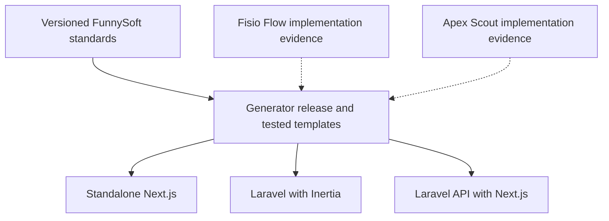
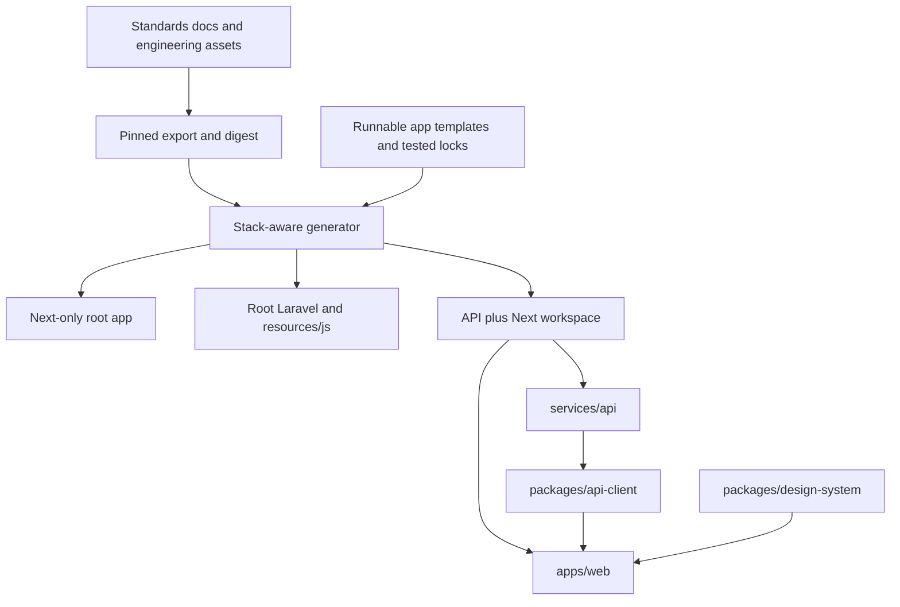
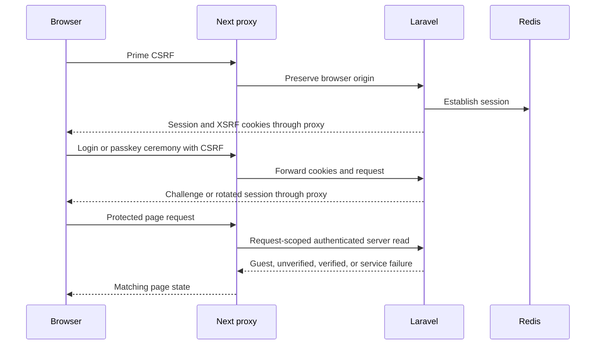
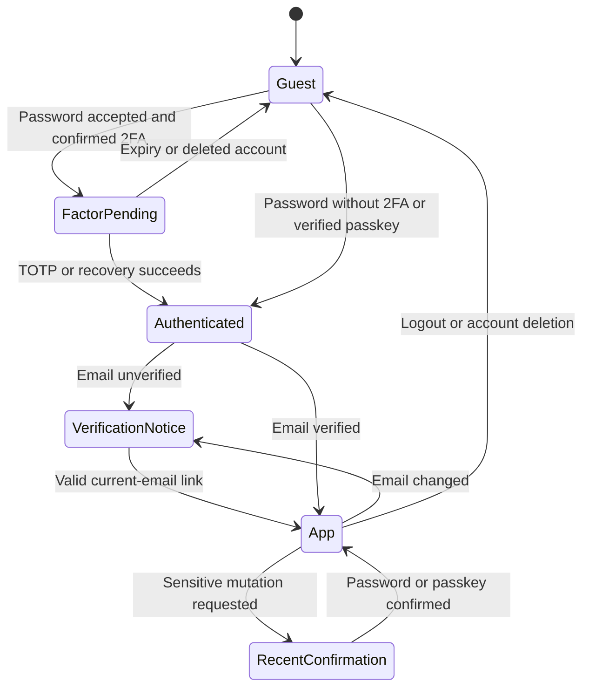
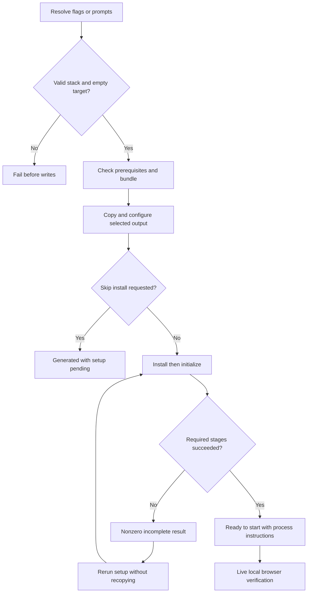
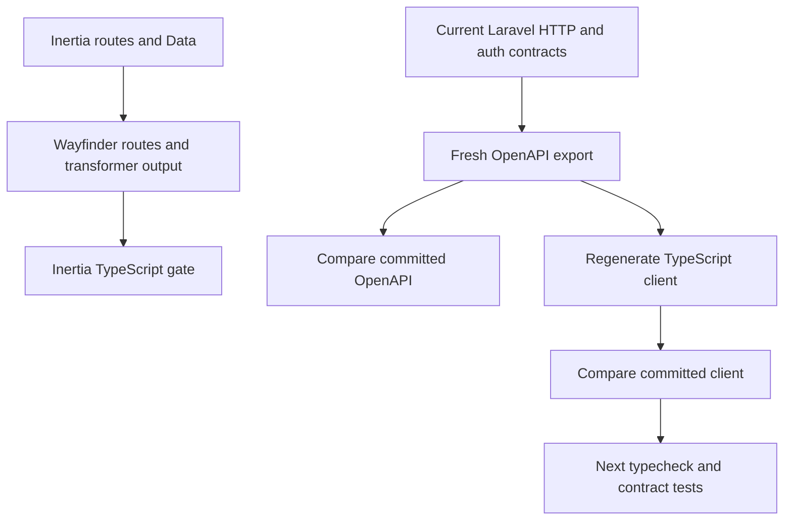

# FunnySoft multi-stack generator - Plan

## Goal Capsule

- **Objective:** A FunnySoft developer can create a locally usable project in any supported stack and start product work without rebuilding account flows or assembling the shared engineering setup.
- **Means:** Expand `create-f7t-app` with standards-backed application templates and coordinated changes to the standards assets, per KTD1.
- **Product authority:** The confirmed generator requirements below govern this work; `../standards/docs/README.md` governs shared engineering policy, with the account-policy additions identified here.
- **Execution profile:** Code implementation across f7t-stack and standards. Start with package and contract proofs, then complete the live local journeys in the Verification Contract.
- **Stop conditions:** Do not substitute for mandatory dependencies, bypass the design approval gate, weaken quality gates, or publish without the release prerequisites below. Failed setup is an incomplete project, per R21.
- **Tail ownership:** The root coordinator owns implementation, issue tracking, commits, coordinated PRs, CI, and release actions in both repositories. Reference applications are read-only evidence.

---

## Product Contract

### Summary

Expand f7t-stack to generate standalone Next.js, Laravel + Inertia, and Laravel API + Next.js projects.
The Laravel variants provide complete individual-user account flows and local setup, while all variants receive the applicable FunnySoft engineering standards.

### Problem frame

The current generator produces only Next.js projects and offers agent-tooling choices that differ from the shared playbook.
Fisio Flow and Apex Scout v2 contain reusable engineering and account code, but both also contain product dependencies and gaps relative to the intended starter.
Copying either application carries those dependencies into new projects, while copying the standards stamp alone does not produce a runnable application.

### Actors

- A1. FunnySoft developer creating and configuring a new project.
- A2. Application user signing in and managing an individual account.
- A3. Project maintainer releasing generator templates and compatible standards assets.

### Key decisions

- **Laravel account scope.** Governs R3, R9-R17. (session-settled: user-directed, chosen over authentication in all three stacks: standalone Next remains suitable for sites and marketing.)
- **Individual-user baseline.** Governs R4. (session-settled: user-directed, chosen over optional or mandatory teams: complete the shared foundation before a reusable organization model.)
- **Single-repository API + Next.** Governs R2. (session-settled: user-directed, chosen over separate repositories: coordinate setup and contracts while deploying the applications separately.)
- **Shared FunnySoft configuration.** Governs R9-R10. (session-settled: user-directed, chosen over an administrator settings screen: control registration through application configuration.)
- **Email verification applies to provisioned accounts.** Governs R12-R14. (session-settled: user-directed, chosen over Fisio's already-verified provisioning: use the verification flow for the first account too.)
- **Optional authenticator enrollment.** Governs R16. (session-settled: user-directed, chosen over mandatory 2FA or passkeys alone: include the complete capability without requiring enrollment.)
- **Local-ready generation.** Governs R18-R20. (session-settled: user-directed, chosen over files-only generation or cloud provisioning: complete local setup and connect production accounts separately.)
- **Prewired service integrations.** Governs R8. (session-settled: user-directed, chosen over wizard-selected services: include the four selected integrations in every Laravel project.)
- **Retain standalone Next data choices.** Governs R3. (session-settled: user-approved, chosen over applying the Laravel database rule to Next-only: preserve the existing lightweight site options.)
- **Pinned standards and runnable templates.** Governs R5-R7. (session-settled: user-approved, chosen over copying a product wholesale or consuming an untested moving standards version: make generated projects reproducible and product-independent.)

### Requirements

**Stack selection and application shape**

- R1. The generator offers standalone Next.js, Laravel + React through Inertia, and Laravel API + Next.js as distinct stack choices.
- R2. API + Next generates one repository containing one Next application, Laravel in `services/api`, a shared generated API client, and a shared design-token home.
- R3. Standalone Next retains its existing data choices, including SQLite/Drizzle, and does not acquire Laravel or account authentication.
- R4. Both Laravel variants generate individual-user apps whose account flows, navigation, user creation, and operational authorization do not depend on teams or product-specific domains.

**Standards ownership and shared foundation**

- R5. Standards owns shared engineering policy and reusable engineering assets, while f7t-stack owns the wizard and runnable application templates.
- R6. Each generator release consumes a tested, pinned standards version and records that version in generated projects.
- R7. Every generated variant adopts its applicable playbook in `../standards/docs/engineering.md`, `../standards/docs/quality.md`, `../standards/docs/harness.md`, `../standards/docs/design.md`, and the matching variant document, with the explicit deltas in this contract.
- R8. Both Laravel variants prewire Resend, Nightwatch, PostHog, and Turnstile with configuration and activation instructions; local behavior must not require production credentials.
- R9. Both Laravel variants include `config/funnysoft.php` as the home for shared FunnySoft application settings, starting with the registration control.
- R10. Both Laravel variants contain a complete public registration flow that is disabled by default, with server availability and visible sign-up entry points following the same configuration setting.

**Authentication and account lifecycle**

- R11. Both Laravel variants provide login, logout, password reset, and password confirmation with usable success, validation, loading, and failure states.
- R12. In both Laravel variants, application access requires email verification, with a verification notice, resend action, and verification-link handling available to unverified users.
- R13. Both Laravel variants' account settings allow name and email editing, password changes, and account deletion; changing the email clears its verified status and requires verification again.
- R14. Both Laravel variants provide a first-user command that creates an unverified account and sends its verification message without requiring public registration to be enabled.
- R15. Both Laravel variants provide passkey enrollment, login, listing, removal, and confirmation for sensitive account actions.
- R16. Both Laravel variants provide optional authenticator-app 2FA enrollment, confirmation, recovery codes, login challenges, and removal.
- R17. Laravel remains the account-policy authority in API + Next, and the frontend reflects its public authentication capabilities without a second independently maintained registration switch.

**Local operation and deployment readiness**

- R18. Generation installs dependencies and initializes the selected app, with PostgreSQL and Redis guidance using the standards' Herd-based workflow for the Laravel variants.
- R19. Laravel local setup provides an accessible way to retrieve verification and password-reset messages without production email credentials.
- R20. Generated instructions and configuration cover the processes needed to run the selected app locally and its Laravel Cloud/Vercel deployment targets, while external account connection and resource provisioning remain manual.
- R21. The generator explains missing prerequisites and incomplete setup without reporting the project as ready when required setup steps have failed.

**Type contracts, engineering tools, and verification**

- R22. Standards stamping and generated gates account for each stack's directory layout and applicable languages, including omitting Laravel assets and PHP jobs from Next-only output.
- R23. Inertia generates the Wayfinder and TypeScript contracts required by its variant, while API + Next checks the full Laravel-to-OpenAPI-to-TypeScript contract chain.
- R24. The expanded generator preserves non-interactive generation with explicit stack selection and applicable options.
- R25. Generated account screens meet the standards' responsive, accessible, and state-complete design bar, with account logic independent of the source products' branding and navigation.
- R26. Verification covers generation for all three stacks and the conditional account behavior in this contract, following the standards' stubbed CI browser tests and live local journeys.
- R27. Live local verification includes a complete passkey enrollment, login, confirmation, and removal journey rather than relying only on response-level tests.
- R28. The standards update makes the shared account policy in R9-R17 explicit and supplies the stack-aware assets required by R22.

R7 binds the existing shared foundation rather than redefining it here.
In particular, Horizon is already a shared Laravel requirement, not an Inertia-only option or a new policy change.
Conditional dependencies in the playbook remain conditional; R8 is the explicit decision to prewire its four named services.

### Source-of-truth relationship

The diagram illustrates R5-R7 and R22; the requirements remain authoritative.

### Key flows

- F1. Generate and start a project. **Covers R1-R8, R18-R24.**
  - **Actor:** A1.
  - **Steps:** Choose the stack and applicable options, generate the project, complete prerequisite guidance and installation, then run the documented local processes and checks.
  - **Outcome:** The selected app runs locally with the applicable engineering setup and a recorded standards pin.
- F2. Bootstrap the first account. **Covers R10, R12, R14, R19.**
  - **Actor:** A1, then A2.
  - **Steps:** Run the first-user command, retrieve the local verification message, and complete the sign-in and verification flow.
  - **Outcome:** The user reaches the app without opening public registration or bypassing verification.
- F3. Enable public registration. **Covers R9-R12, R17.**
  - **Actor:** A1, then A2.
  - **Steps:** Enable registration in FunnySoft configuration, apply the normal configuration deployment/reload procedure, then sign up and verify the account.
  - **Outcome:** The backend and sign-up entry points agree in either Laravel variant.
- F4. Manage an account. **Covers R11-R13, R15-R16.**
  - **Actor:** A2.
  - **Steps:** Open settings, edit account information or manage authentication methods, and complete the relevant verification or confirmation flow.
  - **Outcome:** Changes persist with understandable feedback and the required account protections.
- F5. Prepare production services. **Covers R8, R20.**
  - **Actor:** A1.
  - **Steps:** Follow generated instructions to connect the chosen hosting accounts and configure service credentials.
  - **Outcome:** Deployment and service activation use the standards' providers without the generator provisioning remote resources.

### Acceptance examples

- AE1. **Covers R1-R3, R22.** Given a Next-only selection, generation produces the existing applicable data option without Composer, Boost, PHP CI jobs, or an account system.
- AE2. **Covers R4, R14.** Given a fresh Laravel project with no team records or team module, a provisioned user can complete verification and enter the app.
- AE3. **Covers R9-R10, R17.** Given registration is disabled, sign-up entry points are absent and a direct registration submission cannot create an account in either Laravel variant.
- AE4. **Covers R9-R10, R12, R17.** When registration is enabled and configuration changes are applied, sign-up becomes available and the new user must verify their email before entering the app.
- AE5. **Covers R11-R12, R19.** Given an unverified user, application access is restricted while verification/resend and logout remain reachable; local verification and reset messages can be retrieved without a Resend production key.
- AE6. **Covers R13.** When a verified user changes their email, the account becomes unverified and app access follows R12 until verification of the new address succeeds.
- AE7. **Covers R14.** Running the first-user command with registration disabled creates an unverified account and a retrievable verification message, not an already-verified account.
- AE8. **Covers R15, R27.** A user can enroll a passkey, sign out, sign in with that passkey, confirm a sensitive action, and remove the credential through the generated interface.
- AE9. **Covers R15, R25.** An unsupported or cancelled passkey operation shows an understandable state without preventing password login.
- AE10. **Covers R16.** A user who has not enrolled in 2FA can use the app; an enrolled user's password-login flow supports both an authenticator challenge and recovery codes.
- AE11. **Covers R8, R18-R21.** With production service credentials absent, the documented local setup supports account journeys; a missing local prerequisite produces actionable guidance rather than a false success message.
- AE12. **Covers R23.** A backend HTTP-contract change that has not reached the generated API client is detected, even when committed TypeScript still matches committed OpenAPI.
- AE13. **Covers R13.** After a user completes the account-deletion flow, that account can no longer authenticate and its active browser session no longer grants access.

### Comparison with the reference projects

These are source-inspection findings, not claims that either application's tests or production deployment were executed successfully.

| Area | Verified reference behavior | Treatment in this work |
| --- | --- | --- |
| Registration | Fisio omits the Fortify registration feature; Apex enables it. | R9-R10 introduce the shared configuration convention. |
| Verification | Fisio's User does not implement `MustVerifyEmail`; Apex's does. | R12-R14 adopt verification for both variants and provisioned accounts. |
| Passkeys | Fisio has enabled passkey code; Apex omits the feature and asserts it is disabled. | R15 and R27 require an API + Next implementation and end-to-end evidence. |
| Settings | Fisio has a broader account-management baseline; Apex's inspected account form lacks passkey and 2FA management. | R13-R16 establish the shared scope rather than inheriting the smaller form. |
| Teams | Fisio's auth redirects and user creation depend on teams. | R4 requires extracting the account behavior from those dependencies. |
| Queues | Fisio installs Horizon; standards documents Apex's managed queues as a deviation. | R7 follows the playbook default. |
| Type generation | Fisio calls `typescript:transform` without a direct transformer dependency; Apex's schema gate only regenerates from saved OpenAPI. | R23 requires complete contracts; Fisio runtime command availability remains unverified. |
| Shared assets | Standards stamp copies Boost unconditionally; its quality workflow executes Composer and Artisan at the root. | R22 and R28 require variant-aware assets. |

### Scope boundaries

- Teams, organizations, memberships, invitations, and a general administrator panel are deferred.
- No standalone Next authentication, mobile app, separate operations app, or bundled marketing app is added.
- No automatic cloud-resource provisioning, production credential acquisition, or changes to live services are included.
- Fisio clinic features, team roles, Apex driver onboarding, catalog permissions, social features, and multi-app session routing are not template features.
- Realtime, search, object storage, AI, billing, and other product capabilities are not added merely because a reference app installs their dependencies; their provider choices remain governed by R7 when needed.
- Updating already-generated apps and retrofitting the new account policy into Fisio or Apex are separate work.
- This contract covers coordinated changes in f7t-stack and standards; the reference apps remain evidence sources.

### Dependencies and assumptions

- The standards pin selected for the generator must include R28 and remain available to release tooling. KTD1 and PA1 define distribution; the exact release identity is assigned after the coordinated standards changes are tested.
- Source references use paths relative to the f7t-stack repository root: standards is `../standards`, Fisio is `../fisio-flow`, and Apex is `../../apex-scout-v2`.
- Local infrastructure follows the shared playbook. A local email viewer or transport is an implementation choice, not permission to skip R19 or provision a second production email vendor.
- API + Next inherits Scramble Pro from its variant; implementation planning must verify package entitlement and credential delivery before promising unattended installation.
- Library versions and APIs must be checked during implementation planning; dependency manifests in the reference apps are evidence, not an instruction to copy their versions blindly.
- Personal model/provider choices and machine-local orchestration remain outside generated project configuration, as required by the harness playbook.

### Outstanding questions

**Resolve Before Planning:** None.

**Planning disposition:** Packaging, flags, recovery, local mail, session transport, confirmation, operational permissions, and dependency-delivery mechanisms are specified in the Planning Contract. The purchaser's Scramble Pro entitlement, exact authenticated access instructions, and successful locked download remain release prerequisites, not assumed facts. Account-screen direction remains an execution-time owner-selection gate under the existing design standard; no theme or localization expansion is inferred.

### Sources and research

Paths below are repository-root-relative. Line references describe the source inspected on 2026-09-08.

**Generator and standards**

- `cli/src/config.ts:3-25,46-66`: current configuration and defaults.
- `cli/src/create-app.ts:29-48`: unconditional base copy and installation flow.
- `../standards/docs/engineering.md:82-158`: Laravel foundation, service choices, conditional dependencies, and frontend policy.
- `../standards/docs/variants/inertia-monolith.md`: Inertia layout, contracts, passkeys, and local/deploy conventions.
- `../standards/docs/variants/api-next.md`: modular API, generated client, and Horizon versus Apex deviation.
- `../standards/docs/variants/next-only.md`: frontend-only stack and engineering setup.
- `../standards/docs/quality.md:23-47`: frontend gates and stubbed CI versus live local browser testing.
- `../standards/docs/harness.md:24-51`: portable project configuration, pinning, and Boost integration.
- `../standards/scripts/stamp.sh:31-36` and `../standards/templates/github/workflows/quality.yml:59-69`: current stamping and root-Laravel assumptions.

**Fisio Flow**

- `../fisio-flow/config/fortify.php:147-175`: passkey configuration and enabled features.
- `../fisio-flow/app/Models/User.php:9-39`: verification-interface omission and team/passkey traits.
- `../fisio-flow/routes/settings.php:15-49`: account and team settings routes.
- `../fisio-flow/app/Http/Responses/Concerns/RedirectsToCurrentTeam.php:14-31`: team-dependent auth destinations.
- `../fisio-flow/app/Console/Commands/CreateUserCommand.php:19-58`: existing provisioning command, including immediate verification.
- `../fisio-flow/scripts/quality-gate.sh:28-43` and `../fisio-flow/composer.json:17-55`: transformer gate and direct dependency declarations.

**Apex Scout v2**

- `../../apex-scout-v2/services/api/config/fortify.php:34-50`: JSON auth features, including registration and 2FA but not passkeys.
- `../../apex-scout-v2/services/api/Modules/Identity/Models/Users/User.php:52-60`: email-verification contract.
- `../../apex-scout-v2/services/api/tests/Architecture/ArchitectureTest.php:234-240`: passkeys-disabled assertion.
- `../../apex-scout-v2/apps/scout-web/components/account-form.tsx:20-121`: inspected account functionality.
- `../../apex-scout-v2/scripts/generate-api-client.sh:8-20`, `../../apex-scout-v2/scripts/frontend-gate.sh:18-20`, and `../../apex-scout-v2/packages/api-client/package.json:9`: full generation versus existing schema gate.

---

## Planning Contract

Product Contract unchanged. Planning questions above now point to their technical dispositions; R1-R28, A1-A3, F1-F5, AE1-AE13, and all session-settled decisions retain their meaning.

### Key technical decisions

- KTD1. **One versioned standards source, runnable templates in f7t-stack.** Implement R5-R7 and R28 through a release compatibility manifest and stack-aware standards export. Generated projects record the generator version, template revision, standards release and commit, and asset digest. Standards owns policy and engineering assets; application source belongs to the generator. This instantiates the pinned-template decision, without introducing a runtime dependency on the standards checkout. (session-settled: user-approved, chosen over copying a product wholesale or consuming moving standards: reproducible, product-independent output.) The bundled distribution mechanism is PA1.
- KTD2. **Laravel owns the account state machine.** R9-R17 use Fortify with the session-backed web guard, the email-verification contract, and framework confirmation semantics. Inertia shares public capabilities through props; API + Next exposes a public capabilities resource from the same Laravel settings. Enforce the registration switch at request time as well as feature/route registration, so cached routes and stale pages cannot reopen signup. Configuration and route-cache rebuilds must be documented.
- KTD3. **Use supported passkey and authenticator behavior.** Fortify 1.39.0 and PHP passkeys 0.2.1 provide login, enrollment, removal, and confirmation. Add safe listing because Fortify has no listing endpoint. Passkey confirmation sets Laravel's recent-password-confirmation timestamp. Confirmed authenticator enrollment challenges password login; passkey login requires WebAuthn user verification and does not enter the TOTP pipeline. A passkey login does not itself confer recent confirmation. This implements R15-R16 and AE10 without custom factor orchestration. See the vendor evidence below.
- KTD4. **Protect sensitive mutations through recent confirmation.** Under R13 and R15, email/password changes, deletion, passkey changes, authenticator management, and recovery-code access use the same password-or-passkey confirmation boundary. Do not copy Fisio's extra raw-current-password validation into those mutations, because it would reject a successfully passkey-confirmed user. JSON clients handle 423 by confirming and retrying the intended action once. Keep name-only changes outside that extra confirmation boundary.
- KTD5. **Keep HTTP identifiers and contracts variant-correct.** R7 and R23 bind the two variant documents. API + Next keeps integer database keys and UUID v7 public identifiers, snake_case JSON, and JsonResource responses. Inertia uses its prescribed Data/props and Wayfinder contracts. API verification links must authorize the public user UUID and current email hash: stock `EmailVerificationRequest` compares the route ID to the database key and cannot be copied unchanged. Use a configured passkey model with a public UUID route key and safe resources, rather than exposing its default integer key or credential payload.
- KTD6. **Contract freshness starts from Laravel.** R23 is a chain: current routes, requests, resources, and auth responses produce fresh OpenAPI; fresh OpenAPI produces the client; both are compared with committed artifacts. A saved-schema-to-client check alone is insufficient. Account endpoints, vendor-owned Fortify routes, 2FA branches, 423 responses, and validation errors require explicit schema coverage where inference is incomplete.
- KTD7. **Licensed dependencies are installed, never redistributed.** Scramble Pro remains mandatory for API + Next under R7. Its private package is `dedoc/scramble-pro`, from Dedoc's Composer repository. Distribute manifests and sanitized lockfiles, not `vendor/`, archives, keys, authentication files, or authenticated URLs. Composer consumes an already configured global credential source or inherited `COMPOSER_AUTH`; the generator neither accepts a license-key flag nor guesses Dedoc's authentication mapping. A successful authorized download of the locked version is the access proof. Failure follows R21, with no fallback to free Scramble or committed schema-only operation.
- KTD8. **Policy is executable across all layouts.** R7 and R22 bind `../standards/docs/quality.md` and `../standards/docs/harness.md`. Mandatory tooling is baseline output, not optional extras. Stack-aware asset selection includes applicable gates, OpenCode files, actual Boost skills and guidelines for Laravel, and copied pinned playbook documents. Next-only receives no Laravel package, PHP job, Boost command, or PHP-only rule. No personal providers, models, permissions, or symlinked global configuration are copied.
- KTD9. **Design approval precedes account-screen implementation.** R25 binds `../standards/docs/design.md`, including Mobbin research, two screenshot-backed directions when unchosen, owner selection, and mock-to-route desktop/mobile comparison. Planning supplies the candidate composition in PA8, not an invented approval. Missing Mobbin access or owner selection stops the affected UI unit. Backend and packaging work can proceed independently.
- KTD10. **Expose native Horizon through the existing frontend proxy.** Under R7, API + Next serves `/horizon` at the frontend origin and forwards the same path to Laravel. Reuse PA4's fixed upstream and cookie transport, with native dashboard HTML and internal requests; add no separate authentication system, asset service, or vendor UI fork. (session-settled: user-approved, chosen over direct API-hostname access as the default: reuse the existing session with a bounded proxy extension.) Approval is conditional on bounded complexity. If selected-runtime proof requires substantial custom asset or authentication machinery, the coordinator may invoke the user-accepted API-hostname fallback only after specifying and proving a real authenticated browser path with the same verification and permission policy. A bare API URL cannot use the frontend host-only cookie. Update this topology in place before continuing under that fallback.

### Assumptions

These are planning defaults, not new session-settled product decisions. They resolve technical forks for implementation while keeping their provenance visible; Horizon topology follows the approved KTD10.

- PA1. Bundle an immutable, digest-checked standards export inside the npm package at `template/standards/`. A release manifest identifies the export and compatible stack templates. Keep `template/base/` and `template/extras/` for Next; add complete `template/stacks/inertia-monolith/` and `template/stacks/api-next/` trees. Export once from standards, consume the same export in direct stamping and generator tests. Reject mismatched digests before target writes. This avoids generation-time GitHub access and divergent stamp implementations.
- PA2. Use `--stack next-only|inertia-monolith|api-next`. Calls without a stack keep the existing Next default. A single discriminated configuration drives prompts and flags. Laravel defaults to English and an application shell; existing Next data and localization options retain their present semantics. Reject Next-only data/shell/localization options on Laravel rather than silently ignoring them. Mandatory OpenCode, applicable shadcn, and quality workflows cannot be disabled; reject obsolete conflicting flags with migration guidance. `--skip-install` remains a files-only escape hatch with an explicit setup-pending result.
- PA3. Replace nonempty-target overlay with rejection, including legacy `--force`, in the documented breaking CLI release. Generated setup is a separate rerunnable operation, not regeneration. It preserves application keys, local configuration, user files, database contents, and completed steps. Record nonsecret stage results in an ignored setup-state file; recheck reality rather than trusting a completed marker. Human and structured CLI results report the same stack, failed stage, pending steps, and recovery entry point.
- PA4. API + Next uses `apps/web`, `services/api`, `packages/api-client`, and `packages/design-system` in a Bun workspace. All browser auth/API traffic uses a fixed-upstream Next Route Handler proxy at the frontend origin. Use a host-only HttpOnly session cookie, root path, SameSite=Lax, Secure on HTTPS, and a separate readable XSRF cookie. Preserve each upstream Set-Cookie header and incoming browser Origin/Referer. Do not manufacture trusted browser origins. A separate server-only client forwards the session cookie and a configured frontend Origin for server-generated reads, with no shared user cache. Laravel remains authoritative on every request.
  Horizon extends that proxy only at `/horizon` and its path-boundary descendants, preserving the native path on both hops. Preserve navigation Accept and upstream content types; pass HTML through without forcing JSON or rewriting vendor assets. Forward redirects without server-side following; map only known authentication/verification destinations to frontend routes with a validated local continuation, and reject unapproved external destinations. Dashboard HTML, internal responses, and error/redirect responses are private and uncached across browser, Next, and CDN layers. Normal GET navigation may omit Origin: Horizon uses Laravel's session-enabled web middleware rather than depending on Sanctum's Origin-based API classification. Mutations retain incoming Origin/Referer validation and CSRF protection. Normalize and bound paths before forwarding; neither a request-selected upstream nor escape from the declared mounts is allowed.
- PA5. API verification email links land on the frontend, preserve a local continuation through login/2FA, and submit the untouched signed API path/query through the proxy. Laravel uses expiring relative signatures plus authenticated UUID/current-email validation. The RP ID is the stable frontend hostname; allowed WebAuthn origins include exact scheme and port. Use a stable HTTPS Herd frontend host for local passkeys and a stable named preview host when validating deployment behavior. Random preview hostnames are not an interchangeable RP identity.
- PA6. Herd Pro is the documented reference local environment for PostgreSQL, Redis, and its SMTP mail viewer. Accept explicit local connection overrides and verify actual ports. Documented defaults are PostgreSQL 5432, Redis 6138, and SMTP 2525, not an assumed Redis 6379. Setup uses a dedicated empty project database, isolated Redis namespaces and session storage, generates an application key only when absent, migrates, and generates contracts. Production accounts remain manual. A readiness result distinguishes initialized/ready-to-start from a running, browser-verified application.
- PA7. The first-user command bootstraps an empty user table only, accepts nonsecret fields non-interactively and the password through protected input, and creates no operational grant. If mail delivery fails after creation, keep the unverified account and recover with resend. A separate local console permission command grants or revokes `viewHorizon` through Spatie permission, with teams disabled. Horizon requires that permission and verified authentication, including locally. Public signup never grants it. Unverified users may correct an email through a narrowly scoped, recently confirmed settings action, while protected application content remains inaccessible.
  Inertia uses its native `/horizon`; API + Next uses KTD10's frontend `/horizon`. Apply authentication, verification, and the permission gate to every dashboard and internal route, overriding any vendor local-environment bypass. Guest or expired-session HTML navigation redirects to frontend login with a safe local return path; unverified HTML navigation goes to verification, while verified users lacking permission receive denial. Internal requests preserve 401/403 and never receive login HTML as successful JSON. After session expiry, reload reaches login and can resume the dashboard after authentication; no custom vendor polling or login UI is required. Revocation takes effect on the next request, including polling and mutations.
- PA8. Explore two reusable account-screen directions: a focused single-column account workspace with persistent settings navigation, and a split layout with security status beside the active form. Both use one shadcn component kit and one chosen local font family, with semantic tokens in the variant's design home. Prefer the focused layout for small account tasks, but do not select it on the owner's behalf. No reference-product branding, product navigation, marketing hero, or unrequested localization is inherited. The design search returned a documentation-landing pattern unsuitable for account settings, so it was rejected; accessible-authentication guidance remains applicable.
- PA9. Local Resend configuration selects Herd SMTP; Nightwatch is explicitly disabled in local/testing; PostHog does not initialize without explicit enablement and configuration; Turnstile uses Cloudflare's documented dummy pair with real Siteverify for live local runs. CI stubs external interactions deterministically. These local defaults satisfy R8 without production credentials, but live Turnstile still needs network access. Production service activation follows generated instructions and never accepts dummy Turnstile configuration.

### High-level technical design

**Generated layout and ownership, KTD1, KTD8, PA1, PA4**

**Session protocol, KTD2-KTD4, PA4-PA5**

Session-writing requests, including passkey options, stay browser-to-proxy. Server Components cannot relay cookie writes automatically. An expired backend session must return the user to a browser-visible login/CSRF flow rather than render a false authenticated state.

For KTD10, browser `/horizon` navigation follows Browser -> Next fixed proxy -> Laravel web session and verified/permission gates -> native HTML through Next. Dashboard internal requests remain under `/horizon/api`; the proxy preserves their JSON contract and cookies without caching or a second account authority.

**Account state, KTD2-KTD4**

**Generation and recovery lifecycle, R21, PA2-PA3, PA6**

Preflight failures stop before copying when detectable. A failed copy is not resumable setup: preserve the partial directory and require a new empty target or deliberate manual cleanup. Setup never repairs partial template copying through overlay.

**Contract data flow, KTD5-KTD6**

**CLI applicability matrix, PA2**

| Input | Next-only | Inertia | API + Next |
| --- | --- | --- | --- |
| Omitted stack | Legacy default | Explicit selection required | Explicit selection required |
| Data none/Sanity/Drizzle | Preserve | Reject | Reject |
| Drizzle SQLite/PostgreSQL | Preserve | PostgreSQL baseline, no Drizzle | PostgreSQL baseline, no Drizzle |
| Existing Next shell/intl/locale | Preserve | Fixed English account app | Fixed English account app |
| Resend selection | Existing optional behavior | Prewired | Prewired |
| `--skip-install` | Setup pending | Setup pending | Setup pending |
| Old harness or policy-off flags | Reject with replacement guidance | Reject | Reject |
| `--yes`, `--CI`, `--no-git` | Preserve | Supported | Supported |

### Dependency and release prerequisites

The plan can start without acquiring production credentials. These gates constrain dependency installation, UI work, and release; they are not evidence that installation or verification has already succeeded. The root coordinator checks each gate before assigning its first affected milestone.

| Dependency | Evidence and selected handling | Stop/recovery condition |
| --- | --- | --- |
| Standards distribution rights | No root LICENSE was found in the inspected standards checkout. Bundle only assets cleared for generator distribution. | Before public package release, owner records approved redistribution terms and retained notices. Do not infer a license from f7t-stack's MIT license. |
| Reference-code provenance | Record file-level extraction sources and licenses/notices in `template/PROVENANCE.md`. Prefer a clean framework skeleton plus reviewed adaptations. | Unclear rights block redistribution of the affected source, not substitution of unreviewed product copies. |
| Scramble Pro | Public terms allow projects within purchaser/team entitlement, not public redistribution of the Pro package. Composer supplies credentials outside the project. | Before API U5 installation completion and U16/U9 runtime/schema proof, the purchaser supplies nonsecret license scope and official instructions and the coordinator verifies an authorized locked install. Runner entitlement/access gates U14 separately. No credential reads by planning. |
| Runtime compatibility | Inspected Laravel 13.29.0, Fortify 1.39.0, PHP passkeys 0.2.1, Sanctum 4.3.3, Next 16.3.3, React 19.2.8, Bun 1.4.0. | These are candidate baselines, not a tested matrix. Resolve latest stable compatible versions at template freeze, commit locks, and stop on incompatibility rather than dropping capabilities. |
| Herd services | Herd Pro documents the selected services and mail viewer. CLI/site PHP must agree. | Missing service or extension yields actionable prerequisite failure. No Sail/cloud substitution. |
| Mobbin and design selection | KTD9 is mandatory and no direction is approved yet. | U17 owns research/mock creation; the owner selects the direction. Missing access or choice blocks U10-U11, including the signed-in home. |
| CI service access | Standards requires Blacksmith ARM and protected dependency secrets. | Missing runner or licensed dependency access blocks release-grade CI, never produces a green skipped gate. |
| Browser capability | Stable secure frontend origin and a real WebAuthn-capable browser are needed. | Stubbed CI is insufficient for R27. Resolve browser access and finish the live journey before release. |

For Scramble Pro, public documentation does not settle CI/service-key terms, customer-organization transfers, or download availability after an update term expires. The release owner must obtain purchaser or Dedoc confirmation where applicable. The generator stays credential-scheme-agnostic and promises unattended installation only when these prerequisites have been met.

### Source grounding and alternatives

The inspected standards commit is `7c6b9453ff70c75defd39830b49795b2e2f9b84f`; it is not the future compatible release pin. Fisio evidence is from `2ff2cf40cb655c0b165d1ccb670fb6a33cdb6a7a`, and Apex evidence from `fbbf2f2d9bb98bf222adecf30b366bb9bf1a4ee7`. Local source and lockfiles were inspected; runtime behavior was not tested. There is no `docs/solutions/` corpus or root strategy/concepts document in f7t-stack.

- `cli/src/installers.ts` supplies the existing ordered extra-composition pattern. Extend it for Next, rather than replacing all extras with a new plugin framework.
- `cli/src/fs.ts` treats every copied file as UTF-8 and only excludes `node_modules`. U3 must make replacement text-only and exclude dependency/build/runtime/secret files before fonts, screenshots, or PHP templates are packaged.
- `../standards/scripts/stamp.sh` and `../standards/templates/scripts/frontend-gate.sh` establish asset names, but currently copy PHP unconditionally and omit required gate branches. U1-U2 fix the owner rather than embedding a second standards policy in the CLI.
- Fisio's security controller and passkey components are extraction examples; its team redirects, verified provisioning, and raw-password-only mutations are not suitable defaults. Apex's proxy and signing technique are useful, but its browser-only auth client, guest verification behavior, and disabled passkeys cannot satisfy this contract unchanged.
- Fortify source: `../fisio-flow/vendor/laravel/fortify/routes/routes.php`; confirmation source: `../fisio-flow/vendor/laravel/passkeys/src/Http/Controllers/PasskeyConfirmationController.php`; factor behavior: `../fisio-flow/vendor/laravel/fortify/src/Actions/RedirectIfTwoFactorAuthenticatable.php` and `../fisio-flow/vendor/laravel/passkeys/src/Http/Controllers/PasskeyLoginController.php`. These support KTD3-KTD4.
- UUID adaptation evidence: `../fisio-flow/vendor/laravel/framework/src/Illuminate/Foundation/Auth/EmailVerificationRequest.php`, `../fisio-flow/vendor/laravel/passkeys/src/Passkeys.php`, and `PasskeysServiceProvider.php`. The package supports a configured passkey model and model route binding; no vendor edit is planned.
- Horizon evidence: `../fisio-flow/vendor/laravel/horizon/src/Horizon.php:185-255` inlines dashboard CSS/JS and exposes configured path/proxy-path variables; `../fisio-flow/vendor/laravel/horizon/routes/web.php` defines internal API routes and the dashboard HTML catchall. The coordinator also checked native dashboard authorization in Laravel docs through Context7. This supports the bounded same-path proxy, not a claim about an installed generated runtime. U16 inspects the selected lock's rendered requests; any additional assets require an explicit tested allowlist, never a wildcard backend proxy or separate asset service.
- Current docs through Context7: [Laravel 13 Fortify](https://github.com/laravel/docs/blob/13.x/fortify.md), [Sanctum](https://github.com/laravel/docs/blob/13.x/sanctum.md), [mail](https://github.com/laravel/docs/blob/13.x/mail.md), and [Next cookies](https://github.com/vercel/next.js/blob/v16.2.9/docs/01-app/03-api-reference/04-functions/cookies.mdx). The indexed Next documentation was 16.2.9, not the exact 16.3.3 manifest version; selected-release proxy behavior remains a verification gate.
- Dependency sources: [Dedoc terms](https://scramble.dedoc.co/documents/terms-of-service), [Pro pricing and team-key FAQ](https://scramble.dedoc.co/pro), [official demo manifest](https://github.com/dedoc/demo-scramble-pro/blob/main/composer.json), [Composer authentication](https://getcomposer.org/doc/articles/authentication-for-private-packages.md), and [locked installation](https://getcomposer.org/doc/01-basic-usage.md). These drive KTD7.
- Local sources: [Herd PostgreSQL](https://herd.laravel.com/docs/macos/herd-pro-services/postgresql), [Redis](https://herd.laravel.com/docs/macos/herd-pro-services/redis), [mail](https://herd.laravel.com/docs/macos/herd-pro-services/mail), [Nightwatch](https://nightwatch.laravel.com/docs/start-guide), [PostHog JS](https://posthog.com/docs/libraries/js), [Turnstile testing](https://developers.cloudflare.com/turnstile/troubleshooting/testing), and [Siteverify](https://developers.cloudflare.com/turnstile/get-started/server-side-validation/index.md). Nightwatch came from official docs through Parallel after Context7 did not resolve it correctly. The old `posthog-nextjs` integration is deprecated; use the current SDK.

Generation-time cloning of standards was rejected in PA1 because it adds network/authentication failure to every generation. Blind product extraction was rejected because both source applications conflict with R4 and the account policy. A second Next account authority was rejected under R17. Adding TOTP after passkey login was rejected as unsupported custom orchestration, not a requirement of AE10.

### System-wide impact

The new CLI intentionally breaks policy-disabling flags and nonempty `--force` overlays. Release notes must name replacements and the retained no-stack Next default. Generated projects have no automatic updater; a later standards upgrade remains deliberate.

User verification, permissions, passkeys, sessions, and pending challenges are related state. Email changes must affect every active session on its next protected request. Deletion must invalidate account access, revoke credentials and permissions, and prevent remembered sessions or outstanding 2FA state from restoring access. Recheck the user at challenge completion; no account state is cached globally in Next.

The existing CLI is the agent interface. Wizard parity, deterministic unattended errors, nonsecret stage results, and setup recovery cover agent access without adding an MCP or agent service. Browser biometrics, purchasing licenses, and selecting a design remain human interactions. Generated OpenCode instructions point to the same pinned documents and commands used by developers.

---

## Implementation Units

All new paths below are proposed. Paths under `template/stacks/` refer to source templates; tests also run against generated copies. In file lists, `I/` expands to `template/stacks/inertia-monolith/`, `A/` expands to `template/stacks/api-next/`, and `M/` expands to `template/stacks/api-next/services/api/Modules/Identity/`. Every entry states its root explicitly. These aliases never appear in generated output.

Units follow dependencies, not numeric order. Shared files have serialized handoffs: U3 then U15 then U13 then U14 own `cli/src/standards.ts` and the compatibility manifest; U5 then U6 then U7 then U8 own Laravel auth configuration; each feature unit updates its dependency manifests/locks, with U14 owning the final lock catalog. The coordinator must not assign concurrent writers to those files. U15 supplies early tooling wiring, U16 proves transport early, and U17 obtains the design decision before screen work.

| Unit | Change | Primary files | Depends on |
| --- | --- | --- | --- |
| U1 | Standards account policy and export | `../standards/docs/`, `../standards/scripts/stamp.sh` | None |
| U2 | Stack-aware mandatory gates | `../standards/templates/`, `../standards/tests/stamp_test.sh` | U1 |
| U3 | Template packaging and provenance | `cli/src/fs.ts`, `template/standards/` | U1 |
| U4 | Stack selection and CLI parity | `cli/src/config.ts`, `cli/src/stacks.ts` | U3 |
| U15 | Early tooling and dependency wiring | `cli/src/standards.ts`, template manifests | U2, U4 |
| U5 | Runnable Laravel foundations | `I/`, `A/services/api/`, `A/apps/web/` | U15 |
| U6 | Account policy and first-user flow | Laravel Identity/account code | U5 |
| U16 | Early proxy/session proof | `A/apps/web/lib/api/` | U5, U6 |
| U7 | Settings and confirmation | Laravel account actions and tests | U6, U16 |
| U8 | Passkeys and authenticator lifecycle | Laravel security code and tests | U7 |
| U9 | Full auth contract chain | `A/packages/api-client/` | U8, U16 |
| U17 | Account mocks and owner selection | `I/design/`, `A/packages/design-system/` | U1 |
| U10 | Inertia account UI | `I/resources/js/` | U8, U17 |
| U11 | Next account UI parity | `A/apps/web/` | U9, U17 |
| U12 | Local setup and integrations | `cli/src/setup.ts`, generated setup | U4-U11 |
| U13 | Final standards conformance | `cli/src/standards.test.ts`, template configuration | U12, U15 |
| U14 | Generation matrix and coordinated release | `cli/src/matrix.test.ts`, CI, README | U1-U13, U15-U17 |

### U1. Publish stack-aware standards policy and export contract

**Goal:** Make standards a usable, versioned source for every generated variant.

**Requirements:** R5-R7, R9-R17, R22, R28; A3, F1. **Dependencies:** None.

**Files:** `../standards/docs/engineering.md`, `../standards/docs/harness.md`, `../standards/docs/README.md`, `../standards/docs/variants/inertia-monolith.md`, `../standards/docs/variants/api-next.md`, `../standards/docs/variants/next-only.md`, `../standards/scripts/stamp.sh`, new `../standards/scripts/export.sh`, `../standards/templates/manifest.json`, `../standards/tests/stamp_test.sh`.

**Approach:** Document the account policy under KTD2-KTD5. Introduce an explicit variant/export contract under KTD1 and PA1, with PHP app root, JS roots, design home, Boost location, and applicable asset sets. Both direct stamping and generator consumption use the same export. Copy pinned playbook docs and retain linked documents needed to read them offline. Preserve unrelated product scripts and binaries.

**Patterns to follow:** Existing stamp token substitution and `../standards/tests/stamp_test.sh`; bind engineering policy rather than copying reference-product exceptions.

**Test scenarios:**
1. Stamp each variant into an empty fixture and verify resolved layout paths, copied docs, source identity, and no unresolved placeholder.
2. Stamp a fixture with unrelated files and binary assets; they remain byte-identical.
3. Next-only export omits every PHP/Boost asset; API export points to `services/api` without requiring a sibling checkout.
4. Invalid variant, absent release identity, or incompatible manifest fails explicitly.

**Verification:** Standards export and stamp tests pass for all variants. No moving branch name acts as the generator's release pin.

### U2. Complete applicable standards tooling and CI

**Goal:** Make generated gates enforce the existing playbook at the correct roots.

**Requirements:** R7, R22-R23, R26, R28; F1. **Dependencies:** U1.

**Files:** `../standards/templates/scripts/php-gate.sh`, `../standards/templates/scripts/frontend-gate.sh`, `../standards/templates/scripts/boost-sync-opencode-skills.sh`, `../standards/templates/lefthook.yml`, `../standards/templates/github/workflows/quality.yml`, new variant assets under `../standards/templates/github/workflows/`, `../standards/templates/opencode.json`, `../standards/packages/boost-guidelines/`, `../standards/tests/stamp_test.sh`, new `../standards/tests/gates_test.sh`.

**Approach:** Implement KTD8 using the include lists and named gates in `../standards/docs/quality.md`. Add PHP type coverage, root-Next React Doctor and formatting, required schema/workflow branches, and stubbed browser CI. Missing dependencies or test tools fail instead of silently succeeding. Keep Playwright out of Lefthook. Generate SHA-pinned Blacksmith ARM workflows and conditional manual-service deployment configuration without provisioning accounts. Correct Composer/Artisan working directories and Boost's source/destination paths.

**Patterns to follow:** Existing shared gate names and quality include lists, not Apex's incomplete schema gate.

**Test scenarios:**
1. Execute fixture gates with instrumented tools and confirm correct working directories and every required invocation.
2. Missing Vitest, Composer dependencies, or a failing type-coverage/doctor/schema check returns nonzero.
3. Next-only workflow contains no PHP job; API PHP checks include module-owned product code.
4. Boost output becomes real `.opencode/skills` files at the repo root and never overwrites the short project brief or adds personal configuration.

**Verification:** The standards gates fixture suite passes; U14 proves them on real generated dependencies.

### U3. Package reproducible templates and provenance safely

**Goal:** Establish packaging and provenance machinery that can carry every stack without source checkouts.

**Requirements:** R5-R7, R21-R22; F1. **Dependencies:** U1.

**Files:** `cli/src/fs.ts`, `cli/src/paths.ts`, new `cli/src/standards.ts`, `cli/src/fs.test.ts`, `cli/src/package.test.ts`, `cli/src/standards.test.ts`, `template/PROVENANCE.md`, `template/standards/`, `template/manifest.json`, `package.json`, `.npmignore`.

**Approach:** Implement KTD1, KTD7, PA1 and PA3. Use text-only token replacement with an explicit file policy and binary preservation. Exclude dependency trees, runtime caches, local databases, real environment files, auth files, and build artifacts. Promote nested ignore files deliberately. Include all templates, playbook files, notices, and executable scripts in the package allowlist. Pin tested transitive dependency graphs. For composed Next extras, use a release lock catalog keyed by dependency-affecting choices so frozen installation does not silently resolve a new graph.

**Execution note:** Prove the packaging contract against existing Next and small stack fixtures first. U14 owns the completed-template inventory and final tested lock catalog after feature dependencies exist.

**Patterns to follow:** Existing extra manifest composition, with `cli/src/paths.ts` discovery retained for `template/base`.

**Test scenarios:**
1. Generate from the packed artifact outside the checkout with no sibling standards/app paths.
2. Check binary hashes, nested dotfiles, script modes, notices, and resolved tokens after copying.
3. Tamper with the standards export digest and verify rejection before target writes.
4. Inspect the package inventory for forbidden credential/runtime files and private dependency archives.
5. Every supported dependency composition selects a matching lock; mismatched configuration fails rather than ignoring frozen-lock errors.

**Verification:** Fixture-based package inventory and packed generation pass; U14 repeats the proof for completed templates and all supported locks. No private package redistribution is required.

### U4. Add stack selection and deterministic CLI behavior

**Goal:** Give the wizard and unattended callers equivalent stack choices and clear failures.

**Requirements:** R1-R3, R21, R24; F1, AE1. **Dependencies:** U3.

**Files:** `cli/src/config.ts`, `cli/src/prompts.ts`, `cli/src/create-app.ts`, `cli/src/index.ts`, `cli/src/next-steps.ts`, new `cli/src/stacks.ts`, `cli/src/config.test.ts`, `cli/src/next-steps.test.ts`, new `cli/src/create-app.test.ts`.

**Approach:** Apply PA2-PA3. Dispatch through a stack registry carrying roots, applicable options, and setup entry points. Validate before writes. Non-TTY callers never wait on prompts; machine-readable results match human messages and contain no secret inputs. Preserve the existing no-stack Next invocation and explicitly document removed policy-off flags and force overlay.

**Patterns to follow:** Existing parser and ordered installers, with Next extras contained in the Next branch.

**Test scenarios:**
1. Covers AE1. Existing Next calls and each explicit stack resolve correctly without Laravel/data-choice leakage.
2. Equivalent wizard and flag selections produce the same normalized configuration.
3. Invalid stack, conflicting flags, missing unattended inputs, and nonempty targets fail before changes, even with `--force`.
4. `--skip-install` reports setup pending; dependency failure never reaches success next steps.

**Verification:** CLI tests cover every applicability-matrix row and non-TTY error path.

### U5. Create complete Laravel application foundations

**Goal:** Supply runnable framework trees rather than a stamp plus empty files.

**Requirements:** R2, R4-R8, R18, R22; F1, AE2. **Dependencies:** U15. API installation completion additionally requires the local Scramble Pro access gate.

**Files:** `I/composer.json`, `I/composer.lock`, `I/artisan`, `I/bootstrap/app.php`, `I/config/`, `I/database/migrations/`, `I/routes/`, `I/app/`, `I/resources/views/app.blade.php`, `I/package.json`, `I/vite.config.ts`, `I/tests/Architecture/ArchitectureTest.php`; `A/services/api/composer.json`, `A/services/api/composer.lock`, `A/services/api/artisan`, `A/services/api/bootstrap/app.php`, `A/services/api/config/`, `A/services/api/routes/`, `M/module.json`, `M/Providers/`, `M/Database/Migrations/`, `M/Tests/Architecture/ArchitectureTest.php`; `A/package.json`, `A/apps/web/package.json`, `A/apps/web/next.config.ts`, `A/apps/web/tsconfig.json`, `A/apps/web/app/layout.tsx`, `A/apps/web/app/health/route.ts`, `A/packages/api-client/package.json`, `A/packages/design-system/package.json`, `A/tests/integration/foundation.test.ts`.

**Approach:** Start from a clean compatible Laravel skeleton and record provenance. Add the standards' required Essentials, Fortify, policies/Spatie permissions without teams, PostgreSQL, Redis/Horizon, nonproduction Eloquent strictness, and stubs, using U15's tooling. Use the variant's layering and identifier policy. Supply safe minimum local/test configuration and process instructions now so foundation and auth tests do not wait for U12. Create a runnable Next server with workspace exports and a non-visual health route for U16's transport proof. The individual-account home and navigation are implemented only in U10-U11 after U17's design approval.

**Patterns to follow:** `../standards/docs/engineering.md` and the variant documents. Reference apps supply isolated patterns, not initial directory copies.

**Test scenarios:**
1. A clean database migrates and boots each app with no team table, product module, role assumption, or source-app service required.
2. Architecture tests enforce concrete Actions/repositories, strict types, route limits, and the applicable public-ID policy.
3. Horizon uses Redis and deny-by-default account authorization; cache clearing does not erase session state.
4. Production credentials absent do not prevent framework boot under local configuration.

**Verification:** Both complete trees install, boot, and pass architecture smoke checks in generated copies.

### U6. Implement registration, login, verification, and first-user provisioning

**Goal:** Make F2 and F3 work through Laravel-owned account policy.

**Requirements:** R4, R9-R12, R14, R17, R19; F2-F3, AE2-AE7. **Dependencies:** U5.

**Files:** `I/config/funnysoft.php`, `I/config/fortify.php`, `I/app/Providers/FortifyServiceProvider.php`, `I/app/Actions/Users/`, `I/app/Models/Users/User.php`, `I/app/Http/Requests/Users/`, `I/app/Console/Commands/CreateFirstUserCommand.php`, `I/app/Console/Commands/HorizonPermissionCommand.php`, `I/routes/auth.php`, `I/tests/Http/Users/AuthenticationTest.php`, `I/tests/Http/Users/VerificationTest.php`, `I/tests/Feature/Console/CreateFirstUserCommandTest.php`, `I/tests/Feature/Console/HorizonPermissionCommandTest.php`; `A/services/api/config/funnysoft.php`, `A/services/api/config/fortify.php`, `M/Providers/FortifyServiceProvider.php`, `M/Actions/Fortify/`, `M/Models/Users/User.php`, `M/Http/Requests/`, `M/Http/Resources/AuthCapabilitiesResource.php`, `M/Notifications/VerifyEmail.php`, `M/Console/CreateFirstUserCommand.php`, `M/Console/HorizonPermissionCommand.php`, `M/Routes/auth.php`, `M/Tests/Http/AuthenticationTest.php`, `M/Tests/Http/VerificationTest.php`, `M/Tests/Feature/Console/CreateFirstUserCommandTest.php`, `M/Tests/Feature/Console/HorizonPermissionCommandTest.php`.

**Approach:** Apply KTD2, KTD5, PA5 and PA7. Share the registration setting with view/capability responses and guard direct submissions. Implement login/logout/reset using supported Fortify responses. Add authenticated, unverified-safe notice/resend/me routes. API verification adapts relative signatures and public UUID authorization without exposing integer IDs. Bootstrap creates the account transactionally, then sends mail; recovery after mail failure uses resend. Add the separate bounded permission command for Horizon.

**Patterns to follow:** Apex's verified model and email-change handling; Fisio's command structure without its already-verified/team behavior.

**Test scenarios:**
1. Covers AE3-AE4. Disabled cached/direct/stale registration submissions fail; enabled registration creates only an unverified ordinary user and capabilities agree.
2. Covers AE2, AE7. Bootstrap works with registration disabled; repeat/nonempty-database attempts fail without mutation or operational grant.
3. Covers AE5. Unverified accounts can see the notice, resend, and logout, but cannot access app data. Confirmed email correction is verified in U7 scenario 5 after settings exist.
4. Valid links verify only the authenticated intended user and current email; expired, replay-after-email-change, tampered, wrong-user, and wrong-hash links fail safely.
5. Mail failure retains the unverified account and supplies the resend recovery path; reset responses avoid revealing account existence.
6. Invalid credentials, throttling, expired reset tokens, session rotation, and logout invalidation follow the framework contract.
7. Grant/revoke changes Horizon access only for the named user; unknown users fail, public signup grants nothing, and an unverified permission holder is denied.

**Verification:** HTTP and command tests prove F2-F3 without teams or production mail; browser integration follows U10-U12.

### U7. Implement account settings and recent confirmation

**Goal:** Make account changes honor verification and password-or-passkey confirmation.

**Requirements:** R11-R13, R15; F4, AE6, AE13. **Dependencies:** U6, U16.

**Files:** `I/app/Actions/Users/`, `I/app/Http/Controllers/Users/`, `I/app/Http/Requests/Users/`, `I/routes/settings.php`, `I/tests/Http/Users/AccountSettingsTest.php`, `I/tests/Http/Users/ConfirmationTest.php`; `M/Actions/Users/`, `M/Http/Controllers/Users/`, `M/Http/Requests/Users/`, `M/Routes/settings.php`, `M/Tests/Http/AccountSettingsTest.php`, `M/Tests/Http/ConfirmationTest.php`.

**Approach:** Implement KTD4 with profile, email, password, and deletion actions. Keep authentication escape routes outside blanket verified middleware. Password changes invalidate other account sessions using a coherent framework-compatible mechanism; deletion invalidates current and other sessions and removes account credentials/permission grants. Recheck identity when completing pending challenges. Account-specific Next data will remain uncached under PA4.

Inventory custom and vendor-owned mutation routes. Disable superseded Fortify profile/password routes or apply the same confirmation boundary, including conditional enforcement for email changes. Enable confirmation for authenticator management and QR/manual-secret/recovery-code reads. Bind pending password-login proof to server-side credential state: changes and resets invalidate old pending challenges, clear them, and require fresh password login. An account-existence check alone is insufficient; U8 completes the factor integration.

**Patterns to follow:** Fisio's request/action/controller separation, without raw-password duplication on recently confirmed mutations.

**Test scenarios:**
1. Covers AE6. Email changes clear verification, notify the new address, reject the old link, and block another active session's app access.
2. Name-only change succeeds normally; duplicate/invalid email and invalid new passwords return field errors without partial changes.
3. Every registered custom/vendor route, including cached routes and secret reads, enforces confirmation before mutation/disclosure, succeeds after either supported ceremony, and requires it again after expiry.
4. Covers AE13. Deleted accounts cannot use current/other sessions, remember cookies, passkeys, reset tokens, or pending 2FA state to regain access.
5. A mistyped email can be corrected from the unverified state only after recent confirmation.

**Verification:** Settings tests cover actual session and account-state transitions, including deletion after passkey confirmation when U8 is integrated.

### U8. Complete passkey and authenticator lifecycle

**Goal:** Provide every R15-R16 operation using supported package behavior.

**Requirements:** R15-R16, R23, R27; F4, AE8-AE10. **Dependencies:** U7.

**Files:** `I/config/fortify.php`, `I/app/Models/Users/Passkey.php`, `I/database/migrations/`, `I/app/Http/Controllers/Users/PasskeyController.php`, `I/tests/Http/Users/PasskeysTest.php`, `I/tests/Http/Users/TwoFactorTest.php`; `A/services/api/config/fortify.php`, `M/Models/Users/Passkey.php`, `M/Database/Migrations/`, `M/Http/Controllers/Users/PasskeyController.php`, `M/Http/Resources/PasskeyResource.php`, `M/Http/Responses/PasskeyRegistrationResponse.php`, `M/Tests/Http/PasskeysTest.php`, `M/Tests/Http/TwoFactorTest.php`.

**Approach:** Apply KTD3-KTD5. Pin PHP/frontend passkey compatibility together. Use package ceremonies and configurable models, never vendor edits or custom cryptography. Return safe passkey metadata only. Treat ceremonies as single-use session state; cancelled, stale, or competing operations fetch new options. Include confirmed enrollment, QR/manual secret, recovery-code display/regeneration, challenges, and removal. Keep raw secrets out of logs and analytics.

Bind the API package's enrollment-response contract to the UUID-safe application response. The stock response explicitly serializes the integer passkey ID; changing model route binding alone does not adapt it. Complete U7's credential-state check at factor completion.

**Patterns to follow:** Fisio security listing and passkey components; installed Fortify/passkeys source cited above.

**Test scenarios:**
1. Covers AE8. Enroll/list/login/confirm/remove succeeds; removed credentials cannot log in, and another account cannot remove or confirm with them.
2. Wrong RP/origin, replayed challenge, expired options, and competing ceremonies fail and can restart with fresh options.
3. Covers AE10. Pending enrollment leaves password login usable; confirmed enrollment requires TOTP or recovery; removal restores normal password login.
4. Recovery codes are single-use; regeneration invalidates old codes; invalid codes do not complete login.
5. A confirmed-2FA user logs in through a user-verified passkey without an extra TOTP stage, but still needs recent confirmation for sensitive changes.
6. Successful API enrollment returns the public UUID used by listing and removal; responses and parameters expose no integer account/credential IDs or stored credential JSON. The generated schema describes that same identifier.
7. After password change or reset, valid TOTP/recovery input against an older pending password-login session cannot authenticate; fresh login with the new password succeeds.

**Verification:** Package-level HTTP integration is green, and U10-U14 retain the mandatory live browser ceremony rather than treating it as covered by mocks.

### U9. Complete API account contracts and transport integration

**Goal:** Extend U16's proven transport through every account operation and the full schema chain.

**Requirements:** R2, R11-R17, R23; F2-F4, AE5, AE12. **Dependencies:** U8, U16.

**Files:** `A/apps/web/lib/api/browser.ts`, `A/apps/web/lib/api/server.ts`, `A/apps/web/lib/api/proxy.ts`, `A/apps/web/lib/api/auth.test.ts`, `M/Support/OpenApi/`, `A/scripts/generate-api-client.sh`, `A/packages/api-client/openapi.json`, `A/packages/api-client/schema.d.ts`, `A/packages/api-client/package.json`, `A/packages/api-client/src/client.test.ts`, `A/tests/contracts/auth-contract.test.ts`.

**Approach:** Apply KTD5-KTD7 and PA4-PA5. Use a fixed upstream, bounded forwarding, correct Origin/Referer checks, and preservation of multiple cookies. Keep session-writing requests browser-visible; use request-scoped server reads for auth gates. Distinguish 401, unverified 403, validation, 423, throttling, and backend unavailability. Generate contracts from Laravel before client comparison, including vendor auth schemas.

**Execution note:** Prove the actual cookie/CSRF round trip before building pages around it.

**Patterns to follow:** Apex's rewrite/CSRF pattern and full generation script, with explicit fixes for SSR and stale-schema gaps.

**Test scenarios:**
1. CSRF priming, login rotation, cookie expiry/deletion, authenticated SSR, and logout work through the real selected proxy implementation.
2. Cross-origin mutations and arbitrary upstream targets are rejected; browser Origin is not replaced by a trusted value.
3. Covers AE5. SSR and Laravel independently deny protected content for guest/unverified users; backend outage renders an error rather than a false signed-out state.
4. Covers AE12. Change a backend field/response while leaving both saved artifacts unchanged; the schema gate fails.
5. Verification continuation survives password/2FA login, preserves the signed query, and rejects external redirects.
6. Concurrent requests from two accounts never share cached identity or cookie state.

**Verification:** Real proxy integration and full contract regeneration pass. Deployment cookie behavior remains part of the release evidence, not inferred from rewrite configuration.

### U10. Design and build the Inertia account experience

**Goal:** Ship an approved, usable account interface for the monolith.

**Requirements:** R11-R16, R19, R23, R25-R27; F2-F4, AE3-AE10, AE13. **Dependencies:** U8, U17.

**Files:** `I/design/DESIGN.md`, `I/design/mocks/account/`, `I/resources/js/pages/auth/`, `I/resources/js/pages/settings/`, `I/resources/js/pages/dashboard.tsx`, `I/resources/js/components/`, `I/resources/js/lib/auth/`, `I/resources/js/lib/auth/flows.test.ts`, `I/resources/js/types/`, `I/config/typescript-transformer.php`, `I/vite.config.ts`, `I/e2e/account.spec.ts`, `I/e2e/security.spec.ts`.

**Approach:** Follow PA8 and KTD9. Obtain the approved desktop/mobile mocks before implementation. Build login, registration, reset, verification, confirmation, profile/deletion, passkey management, and authenticator/recovery views. Keep meaningful form/ceremony logic in tested `lib/`, with page shells composing shadcn components. Generate Wayfinder and TypeScript Data contracts through direct installed dependencies. Permit password-manager autofill, paste, and accessible passkey alternatives.

**Patterns to follow:** Fisio component behavior, stripped of branding, team navigation, and assumed verified state; standards design home and screenshot loop.

**Test scenarios:**
1. Covers AE3-AE7. Config-driven entry points, verification notice, inbox links, and post-verification destinations work through the UI.
2. Covers AE8-AE10. Security UI handles full ceremonies, unsupported/cancelled operations, 423 retries, pending enrollment, and recovery codes without blocking password fallback.
3. Field errors, network/server failure, loading, empty credential lists, and successful mutations have distinct recoverable states.
4. Keyboard-only and mobile flows preserve focus, labels, readable error summaries, dialog return focus, and touch targets.

**Verification:** Approved mocks and rendered screenshots agree at 1440x900 and 390x844; typed contracts and stubbed Playwright pass. Live proof is completed in U14.

### U11. Build Next account UI with Laravel capability parity

**Goal:** Deliver the same complete account workflows through API + Next.

**Requirements:** R2, R11-R17, R25-R27; F2-F4, AE3-AE10, AE13. **Dependencies:** U9, U17.

**Files:** `A/packages/design-system/DESIGN.md`, `A/packages/design-system/mocks/account/`, `A/packages/design-system/tokens.css`, `A/apps/web/app/` auth/settings/verification/home pages, `A/apps/web/components/`, `A/apps/web/lib/auth/`, `A/apps/web/lib/auth/flows.test.ts`, `A/apps/web/e2e/account.spec.ts`, `A/apps/web/e2e/security.spec.ts`, `A/tests/workflows.yml`.

**Approach:** Reuse approved composition and tokens through the one design home. Build against generated contracts and U9 adapters. Registration visibility comes only from Laravel capabilities; stale pages still handle server rejection. Preserve continuations through guest, factor-pending, unverified, and confirmation states. A failed capabilities fetch must show a recoverable loading/error state, not invent an enabled registration default.

**Patterns to follow:** U10's interaction vocabulary and states; Apex's UI files are evidence only.

**Test scenarios:**
1. Covers AE3-AE4. Server capabilities control entry points, enabled registration works, and stale submissions fail when disabled.
2. Covers AE8-AE10. Browser passkey transport reaches `/api` endpoints with CSRF and fresh options; password and recovery alternatives remain usable.
3. Covers AE6, AE13. Email change and deletion update both SSR destinations and client state without stale account data.
4. Every named account workflow has a matching Playwright tag; desktop/mobile, keyboard, and failure states match approved mocks.

**Verification:** Generated API client typechecks, authored library coverage and React Doctor meet policy, and UI parity is demonstrated for all account acceptance examples.

### U12. Add guided local initialization and prewired services

**Goal:** Make generated projects locally usable with honest setup and recovery results.

**Requirements:** R8, R14, R18-R21, R24; F1-F2, F5, AE7, AE11. **Dependencies:** U4-U11.

**Files:** `cli/src/install.ts`, new `cli/src/prerequisites.ts`, `cli/src/setup.ts`, `cli/src/setup.test.ts`, `cli/src/prerequisites.test.ts`, `cli/src/next-steps.ts`; `I/scripts/setup.*`, `A/scripts/setup.*`, `I/config/services.php`, `I/config/mail.php`, `A/services/api/config/services.php`, `A/services/api/config/mail.php`, `I/README.md`, `A/README.md`, `I/resources/js/lib/analytics/`, `I/resources/js/lib/analytics/client.test.ts`, `A/apps/web/lib/analytics/`, `A/apps/web/lib/analytics/client.test.ts`, `I/tests/Feature/Integrations/LocalServicesTest.php`, `M/Tests/Feature/Integrations/LocalServicesTest.php`.

**Approach:** Implement PA3, PA6, PA9 and KTD7. Check Bun, Composer, compatible PHP/extensions and Herd site version, PostgreSQL, Redis, and SMTP. Composer uses preconfigured credentials without echoing them. Initialize locks/dependencies, app key, dedicated database, migrations, and contracts through stack-correct roots. Generate configuration from safe examples without overwriting local values. Document Herd, frontend, Horizon, and later Nightwatch process roles. Next SQLite/Drizzle initialization stays supported; Sanity/external providers report manual connection needs honestly.

**Patterns to follow:** Existing throwing Bun installer, expanded into named setup stages rather than a success-only message.

**Test scenarios:**
1. Covers AE11. Missing tool/extension/service, denied private dependency, network failure, failed migration, and failed contract generation each report incomplete setup and a safe rerun path.
2. Resume after one ecosystem installs preserves the key, local files, and database, and never bootstraps a second user.
3. Covers AE7. Actual verification/reset messages are retrievable in the named Herd mailbox with Resend absent.
4. Disabled Nightwatch/PostHog produce no initialization/telemetry traffic; Turnstile validates dummy local tokens and deterministic CI failures.
5. Production configuration rejects missing or dummy Turnstile credentials; generated instructions explain manual activation of all four providers.
6. Next SQLite and PostgreSQL/Drizzle selections initialize their applicable schema, and explicit skipped setup is never labelled locally ready.

**Verification:** A developer can follow generated instructions from an empty destination through F1-F2 without production credentials. Setup tests and live mail retrieval prove the result.

### U13. Audit standards conformance of completed outputs

**Goal:** Prove that feature additions preserved U15's standards wiring.

**Requirements:** R5-R7, R22-R24, R28; F1, AE1, AE12. **Dependencies:** U12, U15.

**Files:** `cli/src/standards.ts`, `cli/src/agents.ts`, `cli/src/installers.ts`, `cli/src/agents.test.ts`, `cli/src/standards.test.ts`, `template/base/package.json`, `I/composer.json`, `I/package.json`, `A/services/api/composer.json`, `A/package.json`, `template/manifest.json`.

**Approach:** Audit KTD8 and U15 against the completed application trees. Correct drift in generated briefs, include lists, Boost skills, package paths, and check entry points. Finalize application-specific schema/workflow gate integration after U9-U12. Mandatory tooling is already installed by U15/U5; this unit verifies completeness rather than postponing initial wiring.

**Test scenarios:**
1. Covers AE1. Every Next option fixture is free of PHP and Boost while retaining required JS/OpenCode assets.
2. API Boost resolves the guidelines package from `services/api`, emits skills at the workspace root, and preserves authored instructions.
3. Each generated check invokes the correct installed tools and coverage include lists; no missing-tool branch passes.
4. Covers AE12. API schema freshness and workflow registry are reachable through the generated root check interface.

**Verification:** All generated variants satisfy the applicable standards inventory and run their complete local gates from documented locations.

### U14. Verify the generation matrix and ship coordinated repositories

**Goal:** Prove released package contents, account journeys, and standards compatibility together.

**Requirements:** R1-R28; F1-F5, AE1-AE13. **Dependencies:** U1-U13, U15-U17.

**Files:** `cli/src/matrix.test.ts`, `cli/src/test-helpers.ts`, `cli/src/package.test.ts`, `.github/workflows/ci.yml`, `package.json`, `README.md`, `template/PROVENANCE.md`, `template/manifest.json`, `template/locks/`, new `docs/verification/multi-stack-generator.md`; `../standards/tests/stamp_test.sh`, `../standards/tests/gates_test.sh`, `../standards/docs/README.md`, approved release metadata in both repositories.

**Approach:** Execute the Verification Contract against the packed package. Record generated fixture identities, dependency versions, standards digest, browser evidence, and unresolved failures. Coordinate a standards PR and a generator PR with reciprocal links. Standards must merge and receive its immutable release identity before the generator's final pin and packed release matrix are accepted. Publish neither repository's incompatible consumer changes as an untested moving dependency. Root coordinator owns all lifecycle actions.

**Test scenarios:**
1. Full fast composition matrix preserves Next options and exercises both Laravel templates, invalid combinations, and missing prerequisites.
2. Packed installation succeeds for representative dependency graphs and both Laravel variants with authorized Composer access.
3. Stubbed browser CI and live Herd journeys cover AE1-AE13, including complete passkeys on both Laravel variants.
4. A dirty schema, incompatible standards digest, omitted packed file, unavailable required runner, or blocked license access fails release validation.

**Verification:** Both repositories' checks pass at their exact linked revisions, and the release record meets the Definition of Done.

### U15. Wire standards and mandatory dependencies before application installation

**Goal:** Make tooling usable from the first generated foundation.

**Requirements:** R5-R7, R22, R28; F1, AE1. **Dependencies:** U2, U4.

**Files:** `cli/src/standards.ts`, `cli/src/agents.ts`, `cli/src/installers.ts`, `cli/src/agents.test.ts`, `cli/src/standards.test.ts`, `template/base/package.json`, `I/composer.json`, `I/package.json`, `A/services/api/composer.json`, `A/package.json`, `template/manifest.json`.

**Approach:** Apply the tested export through the registry before installation. Supply applicable mandatory tool dependencies, package paths, coverage configuration, short project briefs, and Boost installation/sync configuration. Next base/extras receive applicable OpenCode and JS tooling now. U5 extends these manifests into full applications; U13 checks final conformance.

**Patterns to follow:** KTD8 and the existing compose-before-install order in `cli/src/create-app.ts`.

**Test scenarios:**
1. Each fixture's scripts resolve to declared dependencies before any installation begins.
2. Next-only receives no Composer/Boost asset, and API guidelines paths resolve relative to `services/api`.
3. Generated briefs and skills contain portable roots and no personal configuration.

**Verification:** Tooling composition fixtures pass, with real installation verification delegated to U5 and final matrix proof to U14.

### U16. Prove the API proxy and session boundary early

**Goal:** Establish executable browser/SSR session transport before adding the full account UI.

**Requirements:** R2, R7, R11-R12, R17, R23, R26; F2, AE5; KTD10. **Dependencies:** U5, U6 and the local private-dependency installation gate.

**Files:** `A/apps/web/app/api/[...path]/route.ts`, `A/apps/web/app/sanctum/csrf-cookie/route.ts`, `A/apps/web/app/horizon/[[...path]]/route.ts`, `A/apps/web/lib/api/browser.ts`, `A/apps/web/lib/api/server.ts`, `A/apps/web/lib/api/proxy.ts`, `A/apps/web/lib/api/proxy.test.ts`, `A/services/api/config/sanctum.php`, `A/services/api/config/horizon.php`, `A/services/api/app/Providers/HorizonServiceProvider.php`, `A/services/api/bootstrap/app.php`, `A/tests/integration/session-transport.test.ts`, `A/tests/integration/horizon-transport.test.ts`, `A/tests/integration/servers.ts`, `A/README.md`.

**Approach:** Implement PA4-PA5 using the runnable U5 Next server and U6 auth endpoints. The integration fixture owns start/stop of temporary test processes and isolated local configuration, without depending on the later guided setup UX. Prove cookies, CSRF, rotation, SSR identity isolation, and outage handling now. U9 adds full security-operation schema coverage after U8.

Extend the same transport for KTD10 and PA7. Serve native `/horizon` HTML and internal API routes with session-enabled web middleware, verified authentication, and the permission gate. Keep the same path on both hops; do not force the API client's JSON headers on navigation. Inspect selected-version dashboard requests and allow only any specifically required asset paths. Document the frontend dashboard URL and reload/login recovery. U16 proves redirect destinations and continuation validation with fixtures, without waiting for account screens; U11 integrates the frontend login/verification continuation, and U14 proves the complete real-browser journey.

**Patterns to follow:** Apex transport evidence with the documented SSR/cookie fixes.

**Test scenarios:**
1. CSRF/login/logout round trips preserve all cookies through real Next and Laravel processes.
2. Missing or cross-origin mutation credentials fail; two concurrent users receive only their own server-rendered identity.
3. Guest, unverified, expired-session, and unavailable-backend results remain distinct.
4. A verified permission holder navigates directly to `/horizon` without Origin and receives native HTML; deep-link reloads and internal stats requests work with the frontend cookie. Inspect rendered CSS/JS and network requests against the selected version; required assets resolve only through declared mounts or explicitly tested asset paths.
5. Guest and expired HTML navigation reaches frontend login with a valid local dashboard continuation; unverified users reach verification, and verified users without permission receive denial. Internal requests return the appropriate 401/403 rather than successful login HTML. External, protocol-relative, encoded escape, and request-selected upstream targets are rejected.
6. Grant permission, load the dashboard, revoke permission, then poll and attempt a harmless fixture mutation: both are denied. An unverified permission holder is denied even in local mode. Cross-origin and missing/invalid CSRF mutations fail; valid same-origin fixture mutations succeed.
7. HTML, JSON, redirects, and denials remain uncached and preserve applicable status/content type and all session cookies. Two users never share dashboard data; logout/expiry cannot reveal cached authenticated responses on reload. Same-path redirects stay on the frontend origin; upstream failure remains a service error.

**Verification:** The real transport and native Horizon fixtures pass before U7-U11 depend on the adapters. U14 adds browser login/verification continuation and permission grant/access/revoke proof on both variants, plus stable-preview proof for API + Next. Temporary processes and test data are cleaned up by the fixture. Apply KTD10's bounded-complexity condition if the selected runtime cannot support this topology as specified.

### U17. Obtain approved account design artifacts

**Goal:** Resolve the standards-owned UI decision before screen implementation.

**Requirements:** R25-R26; F2-F4. **Dependencies:** U1 and Mobbin access; completion requires owner selection.

**Files:** `I/design/DESIGN.md`, `I/design/mocks/account/`, `A/packages/design-system/DESIGN.md`, `A/packages/design-system/mocks/account/`.

**Approach:** Explore PA8's two compositions with real Mobbin references, local fonts, semantic tokens, and desktop/mobile mocks. Include the individual-user home, auth forms, verification/confirmation states, settings, security, and destructive actions. Present screenshot-backed options for owner selection under KTD9. Record the chosen direction in the design homes; do not implement screens while this decision is pending.

**Patterns to follow:** `../standards/docs/design.md` and the loaded frontend design/accessibility guidance.

**Test expectation:** No production behavior in this unit. Verify mock completeness and visual/interaction states through browser-rendered desktop/mobile artifacts.

**Verification:** The owner-approved direction and required mock files exist. U10-U11 receive the same approved vocabulary and token system.

---

## Verification Contract

No tests, dependency installations, generated-app boots, or browser journeys were run during planning. Commands below identify project-owned gates; they are not claims of passing results.

### Repository and generated-project gates

| Gate | Working location | Required outcome |
| --- | --- | --- |
| `bun run check` | f7t-stack root | CLI lint/format/types and all generator tests pass. |
| `bash tests/stamp_test.sh` | `../standards` | All variant assets, docs, tokens, and preservation rules pass. |
| New gate/export fixture suite | `../standards` | U1-U2 prove actual command selection and failure propagation. |
| Packed artifact matrix | Outside either checkout | Release contents generate and install without sibling repositories. Existing `F7T_LIVE_CHECK` support must expand beyond base/site. |
| `scripts/php-gate.sh all` | Generated Inertia root | Pint, PHPStan max, Rector, Pest line/type coverage and architecture tests meet the pinned policy. |
| API PHP gate | Generated workspace, targeting `services/api` | Same policy over module/shared include lists, with no root-Composer assumption. |
| `scripts/frontend-gate.sh` named gates | Each generated root | Lint, formatting, typecheck, authored-library coverage, React Doctor, and applicable schema/workflow checks all run. |
| Stubbed Playwright | Generated Laravel frontends in CI | Account UI and error-state journeys pass deterministically; API workflows registry matches tags. |
| Live local browser | Both generated Laravel stacks on Herd | Real Laravel, PostgreSQL, Redis, local mail, and WebAuthn journeys prove R26-R27. |
| Browser visual comparison | Variant design homes | Mock and route screenshots agree at prescribed desktop/mobile sizes after self-review and fixes. |

The existing standards gate names remain the interface. If a script is absent or skipped due to missing tooling, the corresponding requirement is unverified. The release must not lower coverage, exclude meaningful account logic, suppress React Doctor warnings, or replace the full schema chain with saved-artifact comparison to obtain green CI.

### Generation matrix

| Matrix layer | Cases | Evidence |
| --- | --- | --- |
| Fast Next composition | Both shells; none, Sanity, Drizzle SQLite, Drizzle PostgreSQL; dependency-affecting extras and supported locale/intl combinations | Deterministic manifests/lock selection, imports, tokens, standards assets, and negative Laravel assertions. |
| Fast Laravel composition | Inertia and API + Next; default disabled registration and explicit config-enabled fixture | Whole app trees, migrations, account routes, capabilities, dependency manifests, tooling, docs. |
| Failure cases | Invalid flags, non-TTY missing inputs, nonempty target, tampered bundle, missing tool/service, interrupted copy/setup, denied Pro install | Nonzero failures and safe recovery, with no false readiness or damaged existing files. |
| Installed Next | Base/site, app shell, Sanity scaffold, Drizzle SQLite, Drizzle PostgreSQL, maximal compatible extras | Frozen install, build, applicable gates, and initial schema where applicable. |
| Installed Laravel | Both templates from npm package, each with real PostgreSQL/Redis and authorized private dependency access | Boot, migrations, contracts, PHP/JS gates, local process instructions. |
| Account browser | Both stacks, registration off/on, guest/unverified/verified, TOTP pending/confirmed, passkey absent/enrolled, account deletion | F2-F4 and AE3-AE13, including failure states and cross-session effects. |

Fast composition covers every supported configuration. Installed tests cover each unique dependency graph affected by composition before release; the representative cases above are the minimum, not permission to leave other supported lock combinations untested.

### Mandatory live journeys

1. Generate from the packed artifact, finish guided setup, start the documented processes, and retrieve both verification and reset mail in Herd.
2. Bootstrap with registration disabled, sign in unverified, observe denied app access, follow the verification link, and reach the individual-user home.
3. Enable registration and rebuild relevant caches. Register and verify. Disable it again while a stale signup page is open; the server rejects submission and the UI recovers.
4. Edit name/email/password, correct a mistaken unverified email, and prove another active session observes verification/account changes.
5. Enroll a browser passkey, list it, logout, login with it, confirm a sensitive mutation, remove it, and prove it cannot authenticate again. Exercise cancellation and password fallback. A browser virtual authenticator is acceptable when the full ceremony uses the real generated backend, session, database, and origin checks. Record the authenticator method; mocked endpoint responses do not satisfy this live journey.
6. Complete optional authenticator enrollment/confirmation, password-login challenge, recovery-code use/regeneration, and removal. Verify the KTD3 passkey/2FA interaction.
7. Delete the account after recent confirmation; current/other sessions and prior credentials lose access.
8. Use `dev-browser` for real-browser verification and self-review, plus the standards screenshot workflow for stored mock/route evidence. Record stable hostnames, browser/runtime versions, and sanitized outcomes, never passwords, tokens, recovery codes, or credential payloads.
9. In both Laravel variants, verify native Horizon denial before permission grant, successful dashboard/deep-link/internal-request access after grant, and denial after revoke. API + Next stays at frontend `/horizon`, including redirects and requests. Exercise guest login continuation, unverified denial/verification continuation, expired-session polling followed by reload/login recovery, and missing-CSRF mutation rejection. Repeat the API + Next transport journey on the authorized stable preview, using harmless fixture data and recording any selected-version asset allowlist.

### Coordinated shipping and deployment readiness

Both PRs reference this plan and each other. The standards PR owns its policy/assets/tests; the generator PR owns its CLI/templates/package and generated-app evidence. Final generator CI consumes the exact standards release export after merge, not a local sibling or moving branch. If standards integration changes after testing, repeat the affected packed matrix.

Generated deployment instructions cover Laravel Cloud compute, PostgreSQL and Valkey in Frankfurt, Horizon/scheduler roles, migrations and cache reloads, and Vercel frontend configuration with the fixed API upstream and stable public origin. Service-account connection remains manual under R20. Quality runs before serialized Laravel deployment; unconfigured deployment credentials leave deployment explicitly unconfigured without skipping quality. Validate Vercel cookie/CSRF behavior on an authorized stable preview before claiming that deployment topology verified.

A failed generator release is withdrawn or superseded using normal release procedures; existing generated apps retain their recorded pin. No automatic migration of previously generated applications is part of rollback.

---

## Definition of Done

- Every U-ID has its stated verification evidence, and every implementation-affecting R/F/AE is covered by a unit and the matrix.
- Standards and generator changes are linked and tested at exact immutable revisions. Generated projects contain the matching pin, copied playbook, provenance, and compatible locks.
- The packed npm artifact generates all three complete application shapes without source checkouts or redistributed private dependencies.
- Both Laravel variants satisfy the full individual-user account contract, including provisioned-user verification, all settings, optional full authenticator flow, and the live passkey journey.
- Native Horizon browser access satisfies KTD10 and PA7, with real permission grant/access/revoke evidence and no local authorization bypass, shared authenticated cache, or unbounded proxy.
- Local setup retrieves email without production mail credentials and reports partial failures honestly. Retry preserves keys, files, and data.
- Mandatory standards tools run at the correct roots; all required PHP, JS, schema, workflow, browser, and visual gates pass without weakening their policy.
- Owner-approved design evidence exists before UI implementation, and final responsive route screenshots match the approved mocks after real-browser self-review.
- Scramble Pro scope/access and template/standards redistribution rights are cleared for the actual release. No secret values or authenticated URLs appear in source, package contents, logs, or verification evidence.
- Generated local/deployment/provider instructions match the shipped files and distinguish configured readiness from manual production connection.
- Abandoned attempts, temporary fixtures, dead code, unused dependencies, and copied product artifacts are removed from the deliverable. Reference applications are unchanged.
- The root coordinator reports both PR outcomes, CI evidence, release prerequisites, and any uncompleted browser/deployment step explicitly. An unresolved required gate is not a completed release.
